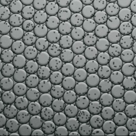

## Detecting cell frequencies with computer vision

My biologist friend wants to be able to take an image like what's below, with an array water droplets containing varying numbers of cells1, and automatically determine the frequency distribution of cells per droplet.

Here's an example what I've been able to do using OpenCV and TensorFlow:

### Details

This is how I've approached the various sub-problems:

1. Detecting droplets. Ordinary circle-detection with OpenCV got most of the way there, but there were some complications regarding the non-circular shapes that come up when the packing structure isn't clean. I ended up defining each droplet with multiple overlapping circles of slightly varying radius--the outermost circle boundaries define the droplets well, and it's still easy to detect when a cell is inside a droplet.

2. Detecting cells. I collected about 700 examples of centered 9x9 images of cells, I trained a CNN and looked at the false negatives, then I refined/expanded the data and trained another CNN with 3500 positive examples. Using the model, I pass a 9x9 window across the image and select the likely cells. This is the main place where there's room for improvement--I'm hoping my friend will get me eight images' worth of cell locations, where the cell locations were centered down to the quarter-pixel. (Centering at the original resolution often puts the cells slightly off to one side.)

3. Image processing. My main pre-processing step was to scale the images to be larger--OpenCV restricts some parameters to integer values (minDist, minRadius, maxRadius), and this lets me get around that. All of my other processing efforts seemed to have very little impact. The image below looks like it would be much easier to work with, but I found that my cell recognition performed no better--maybe the canny edge detection is already accomplishing most of what I was trying to do by hand with pre-processing. 

4. Containment/belonging. Each droplet cluster is made of a number of circles. I find the circle center that each cell is closest to, and then I assign the cell to the corresponding cluster. I also check that the cell is contained inside at least one of the cluster circles, as a way of getting rid of false positives that lie outside the droplets, but this shouldn't be necessary once cell detection is improved.

### To-do

- Improve cell recognition with better training data

### File descriptions
- [cell_counter.py](cell_counter.py): Main code for counting cells per droplet
- [cell_classifier.py](cell_classifier.py): TensorFlow CNN with two convolution layers and a fully connect layer
- [classifier_util.py](classifier_util.py): Tools for training models to recognize cells
- [training_data_tools.py](training_data_tools.py): Tools I used to create training data. One tool is for retrieving click locations on an image, another is for visualizing these to make adjustments, and the third is for generating positive and negative training examples using a list of cell coordinates.

_________________________________________

1Right after getting good results, I learned that the things I thought were cells are actually little containers for cells. But I'll keep referring to them as cells. 