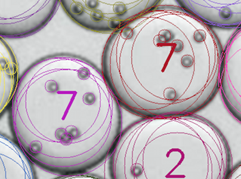
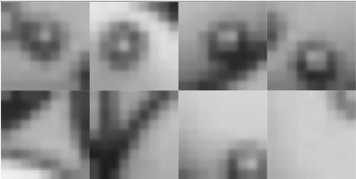
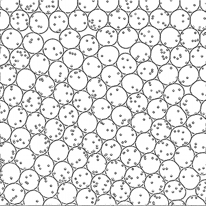

## Detecting bead frequencies with computer vision

A biologist friend of mine wants to be able to take an image like what's below, with an array of water droplets containing varying numbers of beads/cells1, and automatically determine the frequency distribution of beads per droplet.

Here's an example what I've been able to do using OpenCV and TensorFlow:

The automatically generated frequency distributions match handmade distributions closely enough to inform the higher-level decisions regarding how droplets are implanted with beads. In other words, it's a success!

### Details

This is how I've approached the various sub-problems:

1. Detecting droplets. Ordinary circle-detection with OpenCV got most of the way there, but there were some complications regarding the non-circular shapes that come up when the packing structure isn't clean. I ended up defining each droplet with multiple overlapping circles of slightly varying radius--the outermost circle boundaries define the droplets well, and it's still easy to detect when a bead is inside a droplet. Here's an example:

2. Detecting beads. I collected about 700 examples of centered 9x9 images of beads, I trained a CNN and looked at the false negatives, then I refined/expanded the data and trained another CNN with 3500 positive examples. Using the model, I pass a 9x9 window across the image and select the likely beads. Below are four positive examples and four negative examples--the fourth positive example is not great. This is the main place where there's room for improvement--I'm hoping my friend will get me eight images' worth of bead locations, where the bead locations were centered down to the quarter-pixel. (Centering at the original resolution often puts the beads slightly off to one side.)

3. Image processing. My main pre-processing step was to scale the images to be larger--OpenCV restricts some parameters to integer values (minDist, minRadius, maxRadius), and this lets me get around that. All of my other processing efforts seemed to have very little impact. The image below looks like it would be much easier to work with, but I found that my bead recognition performed no better--maybe the canny edge detection is already accomplishing most of what I was trying to do by hand with pre-processing. 

4. Containment/belonging. Each droplet cluster is made of a number of circles. I find the circle center that each bead is closest to, and then I assign the bead to the corresponding cluster. I also check that the bead is contained inside at least one of the cluster circles, as a way of getting rid of false positives that lie outside the droplets, but this shouldn't be necessary once bead detection is improved.

### To-do

- Improve bead recognition with better training data.
- Modify and add documentation to training_data_tools so other people can gather better training data.

### File descriptions
- [bead_counter.py](bead_counter.py): Main code for counting beads per droplet
- [bead_classifier.py](bead_classifier.py): TensorFlow CNN with two convolution layers and a fully connect layer
- [classifier_util.py](classifier_util.py): Tools for training models to recognize beads
- [training_data_tools.py](training_data_tools.py): Tools I used to create training data. One tool is for retrieving click locations on an image, another is for visualizing these to make adjustments, and the third is for generating positive and negative training examples using a list of bead coordinates.

_________________________________________

1Right after getting good results, I learned that the things I originally thought were cells are actually beads that serve as containers for cells. I may not have caught all the old references to cells. 